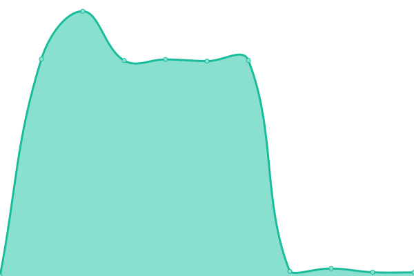

# [📈 Live Status](https://luitz.github.io/fda-uptime): <!--live status--> **🟧 Partial outage**

This repository contains the open-source uptime monitor and status page for [luitz](https://luitz.github.io/fda-uptime), powered by [Upptime](https://github.com/upptime/upptime).

With [Upptime](https://upptime.js.org), you can get your own unlimited and free uptime monitor and status page, powered entirely by a GitHub repository. We use [Issues](https://github.com/luitz/fda-uptime/issues) as incident reports, [Actions](https://github.com/luitz/fda-uptime/actions) as uptime monitors, and [Pages](https://luitz.github.io/fda-uptime) for the status page.

<!--start: status pages-->
<!-- This summary is generated by Upptime (https://github.com/upptime/upptime) -->
<!-- Do not edit this manually, your changes will be overwritten -->
<!-- prettier-ignore -->
| URL | Status | History | Response Time | Uptime |
| --- | ------ | ------- | ------------- | ------ |
|  [TiendaEnLinea](https://www.fahorro.com/) | 🟥 Down | [tienda-en-linea.yml](https://github.com/luitz/fda-uptime/commits/HEAD/history/tienda-en-linea.yml) | 

 781ms
     
 | 

<a href="https://luitz.github.io/fda-uptime/history/tienda-en-linea">0.00%</a>
    

|  [TL-dev](https://devtl-gcp.fahorro.com/) | 🟩 Up | [tl-dev.yml](https://github.com/luitz/fda-uptime/commits/HEAD/history/tl-dev.yml) | 

 10187ms
     
 | 

<a href="https://luitz.github.io/fda-uptime/history/tl-dev">54.52%</a>
    

|  [TL-qa](https://qatl-gcp.fahorro.com/) | 🟨 Degraded | [tl-qa.yml](https://github.com/luitz/fda-uptime/commits/HEAD/history/tl-qa.yml) | 

 19710ms
     
 | 

<a href="https://luitz.github.io/fda-uptime/history/tl-qa">14.99%</a>
    

|  [mw-dev](http://devmiddleware-gcp.fahorro.com/) | 🟥 Down | [mw-dev.yml](https://github.com/luitz/fda-uptime/commits/HEAD/history/mw-dev.yml) | 

 9750ms
     
 | 

<a href="https://luitz.github.io/fda-uptime/history/mw-dev">0.00%</a>
    

|  [mw-qa](http://qamiddleware-gcp.fahorro.com/) | 🟥 Down | [mw-qa.yml](https://github.com/luitz/fda-uptime/commits/HEAD/history/mw-qa.yml) | 

 8310ms
     
 | 

<a href="https://luitz.github.io/fda-uptime/history/mw-qa">0.00%</a>
    

|  [ap-dev](http://devadminportal-gcp.fahorro.com/) | 🟥 Down | [ap-dev.yml](https://github.com/luitz/fda-uptime/commits/HEAD/history/ap-dev.yml) | 

 8118ms
     
 | 

<a href="https://luitz.github.io/fda-uptime/history/ap-dev">15.03%</a>
    

|  [ap-qa](http://qaadminportal-gcp.fahorro.com/) | 🟥 Down | [ap-qa.yml](https://github.com/luitz/fda-uptime/commits/HEAD/history/ap-qa.yml) | 

 8215ms
     
 | 

<a href="https://luitz.github.io/fda-uptime/history/ap-qa">15.04%</a>
    

<!--end: status pages-->

[**Visit our status website →**](https://luitz.github.io/fda-uptime)

## 📄 License

- Powered by: [Upptime](https://github.com/upptime/upptime)
- Code: [MIT](./LICENSE) © [luitz](https://luitz.github.io/fda-uptime)
- Data in the `./history` directory: [Open Database License](https://opendatacommons.org/licenses/odbl/1-0/)
